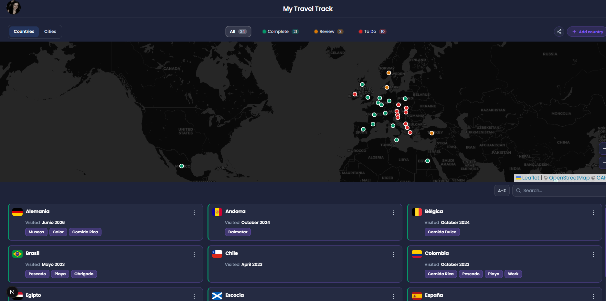
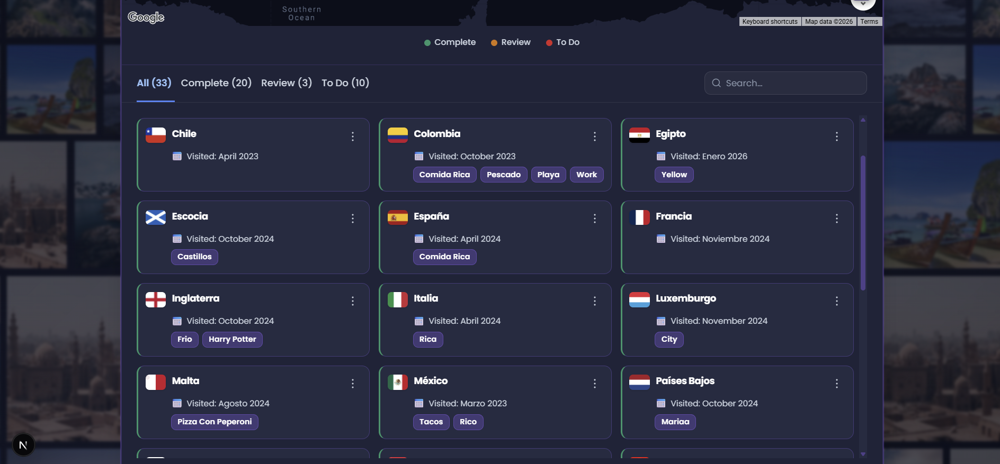

# Building My Travel Bucket List App with Cursor AI: A Journey of Code and Dreams 🗺️

## The Spark: From Recommendation to Reality
A few days ago, a colleague recommended I try an AI-powered IDE or add an AI extension to VSCode to see what the experience was like. That's how I discovered **Cursor** — and I was immediately intrigued.

Fresh off a trip and with an insatiable wanderlust, I decided to combine my passion for travel with testing this new tool. I set out to build something meaningful: a personal travel bucket list application that would help me track my dream of exploring the world.

## The Vision: More Than Just a Checklist
The goal of the app is simple yet beautiful: to follow my dream of completing the most wonderful list of all — **countries to explore**.

I wanted to organize travel aspirations into three clear states:

- ✅ **Complete** — countries I've already visited (with notes, visit date, and tags)
- 🔍 **Review** — countries I'm actively planning or reconsidering
- 📋 **To Do** — countries waiting for their moment

But this wasn't just about tracking countries — it was about **seeing the journey on a map**, watching progress grow, and making the dream tangible every time I open the app.

## What I Built Today: Features That Matter

### Dashboard at a glance
The home screen is now a single, coherent flow:

1. **Stats bubbles** — visited, in review, and to visit counts at the top
2. **Quick Actions** — add a country, share progress, or jump to the list (no duplicate clutter from old filter shortcuts)
3. **World Map + country list** — one unified card: map header, filters, map, legend, tabs, search, and a responsive grid of country cards (up to three columns on desktop)

### Interactive world map

Using the **Google Maps API**, the map shows markers by status. Tapping a pin opens a popup with the country name and status. Filters on the map (**Complete**, **Review**, **To Do**) stay in sync with the list tabs below — one mental model, not two competing UIs.

Custom **zoom controls** sit inset on the map (native Google controls are disabled for a cleaner look). You can also **pick coordinates from the map** when adding a country instead of typing latitude and longitude by hand.

### List, search, and status changes
The old three-column drag-and-drop board evolved into a **tabbed list + card grid**:

- Tabs: **All**, **Complete**, **Review**, **To Do**
- **Search** filters within the active tab, with screen-reader feedback (`aria-live`) for result counts
- On **Complete**, a **progress bar** shows X / 195 countries visited
- Move countries between states via the **↔ Move to** menu on each card (works the same on mobile and desktop)
- **Notes** (view / edit), **delete**, and compact cards with status indicated by border color in narrow layouts

### Empty states and onboarding
Whether you have zero countries, an empty tab, or no search hits, the same **empty-state pattern** appears: short message + **Add country** CTA — so the UI never feels broken, only “waiting for your next trip.”

### Share, export, and backup
- **Share** — copy a link or download a progress image (html2canvas)
- **Export to PDF** — snapshot of the current view
- **Export data** — full list as **JSON** or **CSV** for backup or spreadsheets

### Auth and data per user
The app uses **Auth0**: each user signs in and gets their own list. Data is persisted via API routes (not a single shared JSON file on disk for everyone). That was the right trade-off once the project stopped being a solo demo and became a real “my account, my countries” product.

### Light and dark theme
A polished **light theme** was a deliberate pass: pastel stats, soft shadows, no violet “dark mode glow” leftovers, unified spacing tokens (`--dashboard-stack-gap`, panel shadows), and **Poppins** across the UI including the header title. Theme preference sticks in the browser.

### Accessibility polish
Along the way we tightened **tab contrast**, **focus-visible** rings on filters/tabs/cards/menus, and search announcements — small details that matter if you actually use the app daily.

## The Tech Stack: Simple on Purpose, Serious Where It Counts
| Layer | Choice |
|-------|--------|
| Framework | **Next.js** (App Router) |
| UI | **React** + modular CSS (`_variables.css`, `_components.css`, `_responsive.css`) |
| Map | **@react-google-maps/api** |
| Auth | **@auth0/nextjs-auth0** |
| Export / share | **jspdf**, **html2canvas** |
| Fonts | **next/font** (Poppins) |

I intentionally avoided over-engineering the data layer for a personal product, but I **did** invest in structure: typed country models, hooks (`useLocations`, `useCountryActions`), and map components split under `components/map/`.

> **Note:** `@dnd-kit` remains in `package.json` from an earlier column-based UI; the current list uses tabs + “Move to” instead. A future cleanup can remove unused deps.

## Design iteration with Cursor
Most of the recent UX work happened as a **design checklist** driven in Cursor: unify map + list chrome, sync filters with tabs, stats/quick-actions spacing rhythm, light-theme token audit, empty states, search feedback, and focus styles. Having the AI apply consistent CSS variables across thousands of lines in `_components.css` was far faster than hand-editing every `rgba(139, 92, 246, …)` glow left from the dark theme.

There's also a Spanish **user manual** (`MANUAL_DE_USO.md`) with icons for anyone using the app without reading the repo.

## My Experience with Cursor AI
Building and refactoring this app with Cursor was eye-opening. The assistant helped me:

- Wire **Google Maps** (markers, picking coordinates, custom zoom, theme-aware map styles)
- Integrate **Auth0** and per-user API routes
- Refactor a monolithic map screen into **CountryListCard**, **EmptyState**, modals, and shared utils
- Run a **light-theme and spacing audit** without missing edge cases in responsive CSS
- Implement **accessibility** details (aria-live search, focus rings, tab contrast)
- Keep **builds green** while iterating on layout (unified map/list panel, bleed margins, dashboard tokens)

The conversational flow felt like pair programming: describe the intent (“less boxes inside boxes”, “filters must match tabs”), review the diff, ship. For a side project driven by wanderlust, that loop was exactly what I needed.

## What's next
- **Search feedback in the UI** — show “12 of 33 countries” next to the search field (aria-live already announces it for assistive tech)
- Remove unused dependencies (`@dnd-kit`, etc.) after confirming no legacy screens
- Optional: import from JSON/CSV to restore backups

---

*If you're building your own travel list: start with the dream, keep the data model boring, and let the map be the reward. Cursor made the polish pass possible without turning a passion project into a second job.*